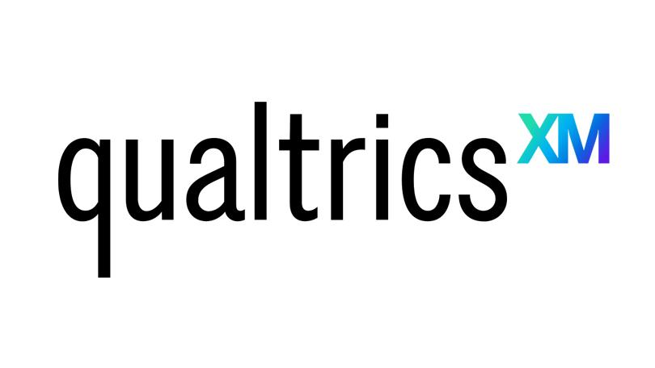
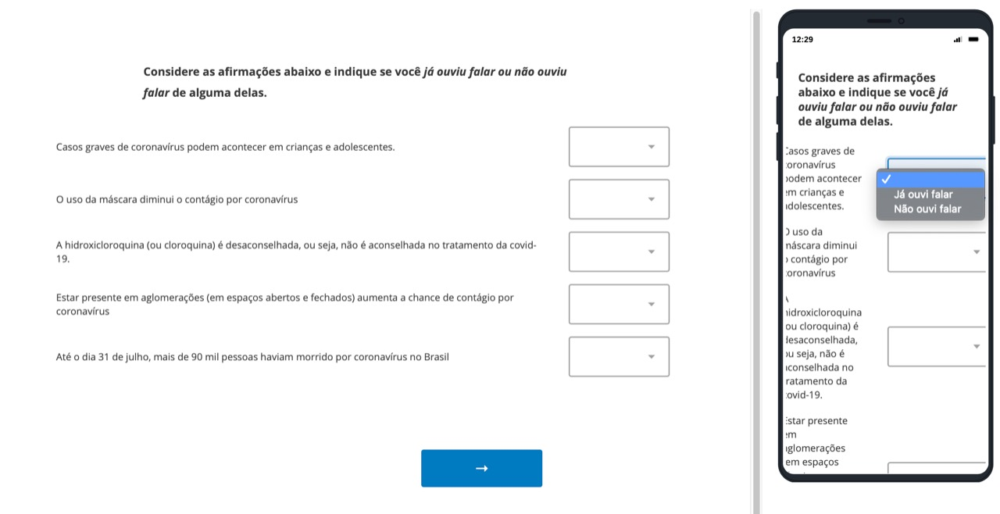
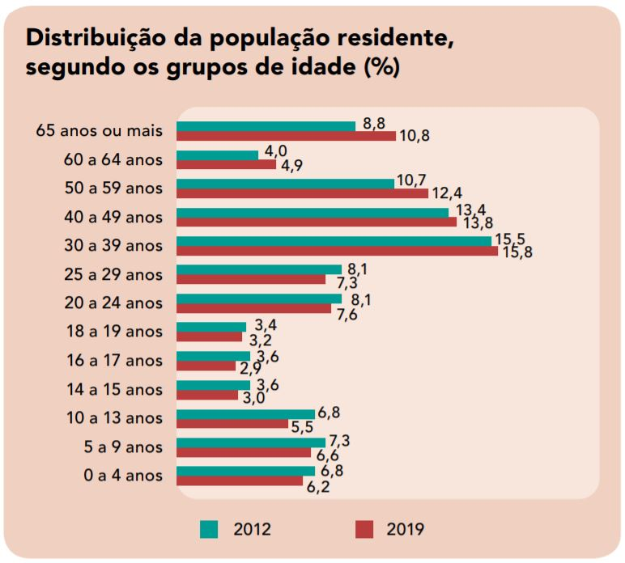

class: middle

## Objetivos

#### - Auferir o acesso dos respondentes a algumas das principais informações relativas à pandemia do novo coronavírus (Covid-19).

#### - Auferir o grau de concordância dos respondentes acerca dessas mesmas informações.

#### - Verificar a representatividade de uma amostra colhida não probabilisticamente em redes sociais.


```{r setup, include=FALSE}
knitr::opts_chunk$set(
	echo=FALSE,
	message = FALSE,
	warning = FALSE,
	fig.align = "center",
	dpi=300
)
```

```{r pacotes, message=FALSE, warning=FALSE, include=FALSE}
library(tidyverse) 
library(kableExtra)
# library(xaringanthemer)
library(RefManageR)
library(readr)
library(gtsummary)
library(pagedown)
library(wordcloud)
library(readxl)
```


```{r, load_refs, include=FALSE, cache=FALSE}
BibOptions(check.entries = FALSE,
           bib.style = "authoryear",
           cite.style = "alphabetic",
           style = "markdown",
           max.names = 3,
           hyperlink = FALSE,
           dashed = TRUE)
myBib <- ReadBib("referencias/referencias.bib", check = FALSE)
```


```{r include=FALSE}
base_survey <-
  read_csv("dados/dados_survey.csv",
           locale = locale(encoding = "UTF-8"),
           skip = 1)


glimpse(base_survey)
```


```{r include=FALSE}
base_survey_renomeada <- base_survey %>%
  slice(-1) %>%  # retira a primeira linha, não contém dados da base
  janitor::clean_names() %>% # função para limpar o nome das bases
  rename(
    #renomear as colunas
    plataforma_info = 11,
    plataforma_info_outros = 12,
    instituicao_info = 13,
    instituicao_info_outros = 14,
    ocupacoes_info = 15,
    ocupacoes_info_outros = 16,
    
    
    ouviu_falar_casos_graves = 17,
    ouviu_falar_mascara = 18,
    ouviu_falar_cloroquina = 19,
    ouviu_falar_aglomeracao = 20,
    ouviu_falar_mortes = 21,
    
    concorda_casos_graves = 22,
    concorda_mascara = 23,
    concorda_cloroquina = 24,
    concorda_aglomeracao = 25,
    concorda_mortes = 26,
    
    idade = 27,
    sexo = 28,
    estado = 29,
    rural_ou_urbano = 30,
    escolaridade = 31,
    religiao = 32,
    religiao_outros = 33,
    faixa_renda = 34
  )

glimpse(base_survey_renomeada)

base_survey_filtrada <- base_survey_renomeada %>%
  filter(idade != "Menos de 18 anos") %>%  # Retira pessoas menores de 18 anos da base de dados
  mutate(
    #Cria a coluna de Região
    regiao_br = case_when(
      estado %in% c(
        "Amazonas",
        "Roraima",
        "Amapá",
        "Pará",
        "Tocantins",
        "Rondônia",
        "Acre"
      ) ~ "Norte",
      
      estado %in% c("Mato Grosso do Sul", "Mato Grosso", "Goiás") ~ "Centro-Oeste",
      
      estado %in% c(
        "Maranhão",
        "Piauí",
        "Ceará",
        "Rio Grande do Norte",
        "Pernambuco",
        "Paraíba",
        "Sergipe",
        "Alagoas",
        "Bahia"
      ) ~ "Nordeste",
      
      estado %in% c("Rio de Janeiro", "São Paulo", "Minas Gerais", "Espírito Santo") ~ "Sudeste",
      
      estado %in% c("Paraná", "Santa Catarina", "Rio Grande do Sul") ~ "Sul"
    )
  )

```

```{r}
base_limpa <- base_survey_filtrada %>%  # Arrumar os levels dos fatores
  mutate(
#    faixa_renda = forcats::as_factor(faixa_renda),
    faixa_renda = forcats::fct_relevel(
      faixa_renda,
      levels = c(
        "Até R$ 1045,00 (até 1 Salário Mínimo)",
        "De R$ 1045 a R$ 2.090 (+ de 1 até 2 Salários Mínimos)",
        "De R$ 2.090 a R$ 3.135 (+ de 2 até 3 Salários Mínimos)",
        "De R$3.135 a R$5.225 (+ de 3 até 5 Salários Mínimos)",
        "De R$5.225 a R$10.450 (+ de 5 até 10 Salários Mínimos)",
        "De R$10.450 a R$15.675 (+ de 10 até 15 Salários Mínimos)",
        "De R$15.675 a R$20.900 (+ de 15 até 20 Salários Mínimos)",
        "Mais de R$20.900,00 (+ de 20 Salários Mínimos)"
      )
    )
  ) %>%
  
  mutate(
    #escolaridade = forcats::as_factor(escolaridade),
    escolaridade = forcats::fct_relevel(
      escolaridade,
      levels = c("Sem instrução",
        "Ensino fundamental incompleto",
        "Ensino fundamental completo",
        "Ensino médio incompleto",
        "Ensino médio completo",
        "Ensino superior incompleto",
        "Ensino superior completo",
        "Pós-graduação incompleta",
        "Pós-graduação completa"
      )
    )
  ) %>% 
  mutate(
    ouviu_falar_casos_graves = forcats::fct_relevel(ouviu_falar_casos_graves,  "Já ouvi falar", "Não ouvi falar")
  )
```
---
class: inverse, middle, center


## Nota Metodológica

---


## Nota metodológica

- **Amostra**: pessoas brasileiras que utilizam redes sociais e possuem idade maior ou igual à 18 anos.

- **Pré-teste**: foi realizado um pré-teste para aprimorar as perguntas.

- **Período de coleta:** 5 dias - 2 de agosto (14h38) até 7 de agosto (14h38).

- **Número de respostas:**

  - **Total: 594 respostas**

  - **Respondidas de forma completa:** **x respostas**

  - **Consideradas na análise:** **`r nrow(base_survey_filtrada)`  respostas**¹ .footnote[¹ Nas respostas utilizadas na análise consideramos apenas aquelas de maiores de 18 anos e aquelas que informaram sua idade, tenham sido completadas ou não completadas]


---
## Nota metodológica

- **Plataforma de questionário utilizada:** [Qualtrics](https://www.qualtrics.com/pt-br/) (plano CoreXM Professional Trial)

```{r echo=FALSE, out.width="30%", include=TRUE}

```


### Divulgação através de redes sociais:

- **Facebook:** divulgação em grupos¹ .footnote[¹Ver [Apêndice 1](#apendice1) para a lista completa dos grupos, e  [Apêndice 2](#apendice2) o questionário utilizado.]

- **Twitter:** compartilhado no perfil de [Beatriz Milz](https://twitter.com/BeaMilz/status/1290297160638926849) e [Pedro Vitorino](https://twitter.com/peu_cesar/status/1290301211305025536).

- **WhatsApp:** envio para familiares, amigos(as), conhecidos(as) e grupos da faculdade.


---
class: middle

# Exemplo da plataforma

## Qualtrics

```{r echo=FALSE, out.width="100%", include=TRUE}

```

---
## Análise dos dados

- `R` `r NoCite(myBib, c("R-Core", "RStudio"))` e `RStudio`:

```{r echo=FALSE, out.width="50%", include=TRUE}
knitr::include_graphics("img/rstudio-r.jpg")
```

- Pacotes do `tidyverse` `r NoCite(myBib, "tidyverse")`:

```{r echo=FALSE, out.width="25%", include=TRUE}
knitr::include_graphics("img/hex-tidyverse.png")
```

---
## Análise dos dados

Os dados foram exportados do Qualtrics como arquivo `.csv`

- Os dados foram importados para o R e arrumados: 

  - Alteração do nome das colunas

  - Remoção de respostas de pessoas menores de 18 anos (e pessoas que não responderam a faixa etária)
  
  - Criação de nova coluna de Região, baseado nas respostas obtidas sobre o estado (UF) em qual reside
  
  - Alteração do tipo de algumas variáveis


- Número de respostas depois da organização e limpeza da base de dados: 
**`r nrow(base_survey_filtrada)`  respostas**

```{r include=FALSE}

porcentagem <- function(data, var){
  data %>%
    group_by({{var}}) %>% 
    summarise(quantidade = n()) %>% 
    mutate(porcentagem = round(100 * quantidade/sum(quantidade), 1)) %>% 
    select(-quantidade) %>% 
    rename("Porcentagem (%)" = 2) 
}

```

---
class: inverse, middle, center
 
## Perfil das pessoas respondentes comparadas com a população


---
class: middle 

### Perfil - Sexo

```{r echo=FALSE}
ibge_sexo <- read_excel(
  "dados/tabelasIBGEAmostra.xlsx",
  sheet = "Sexo",
  col_types = c("text",
                "skip", "numeric")
) %>% janitor::clean_names()


porcentagem(base_limpa, sexo) %>%
  left_join(ibge_sexo) %>%
  rename("Sexo" = 1,
         "Amostra (%)" = 2,
         "População (%)" = 3) %>%
  knitr::kable()

```


Referência - População: [IBGE, 2019](https://educa.ibge.gov.br/jovens/conheca-o-brasil/populacao/18320-quantidade-de-homens-e-mulheres.html)


---
class: middle 

### Perfil - Região 

```{r echo=FALSE}

ibge_regiao <- read_excel(
  "dados/tabelasIBGEAmostra.xlsx",
  sheet = "Regiao",
  col_types = c("text",
                "skip", "numeric")
) %>% janitor::clean_names()

porcentagem(base_limpa, regiao_br) %>%
  full_join(ibge_regiao, by = c("regiao_br" = "regiao")) %>%
  mutate(ibge_2020 = replace_na(ibge_2020, 0)) %>% 
  rename("Região" = 1,
         "Amostra (%)" = 2,
         "População (%)" = 3) %>%
  knitr::kable()

```


Referência - População: [IBGE, 2020](https://biblioteca.ibge.gov.br/visualizacao/livros/liv101707_informativo.pdf)


---

### Perfil - Idade 

.pull-left[

#### Amostra

```{r}
porcentagem(base_limpa, idade) %>% arrange(desc(idade)) %>%
  rename("Idade" = 1) %>%
  knitr::kable()

```


```{r}
# base_limpa %>%
#   group_by(idade, sexo) %>%
#   summarise(quantidade = n()) %>%
#   ungroup() %>%
#   complete(idade, sexo,  fill = list(quantidade = 0)) %>%
#   ggplot() +
#   geom_col(aes(x = idade, y = quantidade, fill = sexo), position = "dodge") +
#   coord_flip() +
#   scale_fill_brewer(palette = "Pastel1", na.value = "grey50") +
#   theme_bw() +
#   labs(x = "Faixa etária", y = "Número de respostas", fill = "Sexo")

```


]

.pull-right[

#### População Brasileira 

```{r echo=FALSE, out.width="100%", include=TRUE}

```


Fonte: [IBGE, 2020](https://biblioteca.ibge.gov.br/visualizacao/livros/liv101707_informativo.pdf)
]


---
class: middle 

### Perfil - Rural ou urbano

```{r}

ibge_area <- read_excel(
  "dados/tabelasIBGEAmostra.xlsx",
    sheet = "RuralUrbana",
  col_types = c("text",
                "skip", "numeric")
) %>% janitor::clean_names()

porcentagem(base_limpa, rural_ou_urbano) %>%
  full_join(ibge_area, by = c("rural_ou_urbano" = "area")) %>%
  mutate(`Porcentagem (%)` = replace_na(`Porcentagem (%)`, 0)) %>% 
 
  rename("Região" = 1,
         "Amostra (%)" = 2,
         "População (%)" = 3) %>%
  knitr::kable()


```


Referência - População: [IBGE, 2019](https://educa.ibge.gov.br/jovens/conheca-o-brasil/populacao/18313-populacao-rural-e-urbana.html) - Dados de 2015


---
class: middle 

### Perfil - Escolaridade

```{r}
ibge_escolaridade <- read_excel(
  "dados/tabelasIBGEAmostra.xlsx",
  sheet = "Escolaridade",
  col_types = c("text",
                "skip", "numeric")
) %>% janitor::clean_names()

porcentagem(base_limpa, escolaridade) %>%
  full_join(ibge_escolaridade) %>%
  mutate(`Porcentagem (%)` = replace_na(`Porcentagem (%)`, 0)) %>% 
  mutate(escolaridade = forcats::fct_relevel(
    escolaridade,
    levels = c(
      "Sem instrução",
      "Ensino fundamental incompleto",
      "Ensino fundamental completo",
      "Ensino médio incompleto",
      "Ensino médio completo",
      "Ensino superior incompleto",
      "Ensino superior completo",
      "Pós-graduação incompleta",
      "Pós-graduação completa"
    ))) %>%
  arrange(escolaridade) %>% 
  rename("Região" = 1,
         "Amostra (%)" = 2,
         "População (%)" = 3) %>%
  knitr::kable()

```

Referência - População: [IBGE, 2019](https://educa.ibge.gov.br/jovens/conheca-o-brasil/populacao/18317-educacao.html)


---
class: middle 

### Perfil - Faixa de Renda 

```{r}
ibge_renda <- read_excel(
  "dados/tabelasIBGEAmostra.xlsx",
  sheet = "FaixaRenda",
  col_types = c("text",
                "skip", "numeric")
) %>% janitor::clean_names()


base_limpa %>%
  mutate(
    faixa_renda = as.character(faixa_renda),
    faixa_renda = case_when(
      faixa_renda == "Até R$ 1045,00 (até 1 Salário Mínimo)" ~ "Até 1 Salário Mínimo",
      faixa_renda == "De R$ 1045 a R$ 2.090 (+ de 1 até 2 Salários Mínimos)" ~ "1 até 2 Salários Mínimos",
      faixa_renda == "De R$ 2.090 a R$ 3.135 (+ de 2 até 3 Salários Mínimos)" ~ "2 até 3 Salários Mínimos",
      faixa_renda == "De R$3.135 a R$5.225 (+ de 3 até 5 Salários Mínimos)" ~ "3 até 5 Salários Mínimos",
      faixa_renda == "De R$5.225 a R$10.450 (+ de 5 até 10 Salários Mínimos)" ~ "5 até 10 Salários Mínimos",
      faixa_renda == "De R$10.450 a R$15.675 (+ de 10 até 15 Salários Mínimos)" ~ "10 até 20 Salários Mínimos",
      faixa_renda == "De R$15.675 a R$20.900 (+ de 15 até 20 Salários Mínimos)" ~ "10 até 20 Salários Mínimos",
      faixa_renda == "Mais de R$20.900,00 (+ de 20 Salários Mínimos)" ~ "Mais de 20 Salários Mínimos",
      
      TRUE ~ faixa_renda
    )
  ) %>%
  group_by(faixa_renda) %>%
  summarise(quantidade = n()) %>%
  mutate(porcentagem = round(100 * quantidade / sum(quantidade), 1)) %>%
  select(-quantidade) %>%
  rename("Porcentagem (%)" = 2) %>%
  full_join(ibge_renda, by = c("faixa_renda" = "faixa_de_renda")) %>%
  mutate(`Porcentagem (%)` = replace_na(`Porcentagem (%)`, 0)) %>%
  ungroup() %>%
  mutate(
    faixa_renda = forcats::fct_relevel(
      faixa_renda,
      "Sem rendimento/Sem declaração",
      "Até 1 Salário Mínimo",
      "1 até 2 Salários Mínimos",
      "2 até 3 Salários Mínimos",
      "3 até 5 Salários Mínimos",
      "5 até 10 Salários Mínimos",
      "10 até 20 Salários Mínimos",
      "Mais de 20 Salários Mínimos"
    )
  ) %>%
  arrange(faixa_renda) %>%
  rename(
    "Faixa de renda" = 1,
    "Amostra (%)" = 2,
    "População (%)" = 3
  ) %>%
  
  knitr::kable()

```

Referência - População: [IBGE](https://seriesestatisticas.ibge.gov.br/series.aspx?no=6&op=0&vcodigo=PD248), PNAD de 2015.

---
class: middle
## Amostra

- As vantagens oferecidas por surveys online, via Facebook, MTurk ou Qualtrics, devem ser consideradas a partir das deficiências desses métodos em comparação com métodos tradicionais, a partir de amostras probabilísticas, coletadas face a face ou por telefone (Samuels & Zucco, 2013 e Boas et. al, 2020). 

- Uma das possíveis deficiências é a falta de representatividade da amostra.

---
class: middle

## Amostra

- Podemos aferir a representatividade de nossa amostra comparando suas estatísticas demográficas com aquelas produzidas por censos ou amostras probabilísticas. Com essa comparação percebemos que nossa amostra não é representativa da população brasileira em várias dimensões. No caso a amostra obtida sobrerrepresenta:
    - mulheres;
    - pessoas com maior escolaridade (superior completo ou incompleto);
    - moradores da região sudeste;
    - pessoas com maior renda;
    - grupo etário de 18 a 34 anos.
    
---
class: inverse, middle, center

## Resultados obtidos


---

- __Pergunta:__ Quais destas plataformas você utiliza para se informar sobre o coronavírus? (Escolha no máximo 2 alternativas)

```{r echo=FALSE}
base_limpa %>% select(plataforma_info) %>%
  mutate(
    plataforma_info = stringr::str_replace_all(
      plataforma_info,
      "Facebook, Instagram, Twitter",
      "Facebook-Instagram-Twitter"
    )
  ) %>%
  separate(
    plataforma_info,
    into = c("plataforma_1", "plataforma_2"),
    sep = ",",
    extra = "merge"
  ) %>%
  pivot_longer(cols = c(plataforma_1, plataforma_2)) %>%
  select(-name) %>%
  group_by(value) %>%
  summarise(quantidade = n()) %>%
  filter(!is.na(value)) %>%
  mutate(porcentagem = round(100 * quantidade / nrow(base_survey_filtrada), 2)) %>%
  arrange(-quantidade) %>%
  rename(
    "Opção" = 1,
    "N Respostas" = 2,
    "Porcentagem (%)" = 3
  ) %>%
  knitr::kable()

```

---


- __Pergunta:__ Quais destas plataformas você utiliza para se informar sobre o coronavírus? (Escolha no máximo 2 alternativas)

- Outros:

```{r wordcloud-fonte-info, echo=FALSE, out.width="50%"}
base_limpa %>% select(plataforma_info_outros) %>%
  pull() %>% wordcloud(scale = c(6, 2))
```


---


- __Pergunta:__ Dentre as instituições abaixo, quais você utiliza como fonte de informações sobre o coronavírus? (Escolha 2 alternativas) 

```{r echo=FALSE}


base_limpa %>% select(instituicao_info) %>%
  mutate(
    instituicao_info = stringr::str_replace_all(
      instituicao_info,
      "universidades públicas, faculdades",
      "universidades públicas - faculdades"
    ), 
  instituicao_info = stringr::str_replace_all(
    instituicao_info,
    "universidades privadas, faculdades privadas",
    "universidades privadas - faculdades privadas"
  )) %>%
  separate(
    instituicao_info,
    into = c("instituicao_1", "instituicao_2"),
    sep = ",",
    extra = "merge"
  ) %>%
  pivot_longer(cols = c(instituicao_1, instituicao_2)) %>%
  select(-name) %>%
  group_by(value) %>%
  summarise(quantidade = n()) %>%
  filter(!is.na(value)) %>%
  mutate(porcentagem = round(100 * quantidade / nrow(base_survey_filtrada), 2)) %>%
  arrange(-quantidade) %>%
  rename(
    "Opção" = 1,
    "N Respostas" = 2,
    "Porcentagem (%)" = 3
  ) %>%
  knitr::kable()

```


---


- __Pergunta:__ Dentre as ocupações abaixo, quais você utiliza como fonte de informações sobre o coronavírus? (Escolha no máximo 3 alternativas)

```{r echo=FALSE}


base_limpa %>% select(ocupacoes_info) %>%
  separate(
    ocupacoes_info,
    into = c("ocupacoes_info_1", "ocupacoes_info_2", "ocupacoes_info_3"),
    sep = ",",
    extra = "merge"
  ) %>%
  pivot_longer(cols = c(ocupacoes_info_1, ocupacoes_info_2, ocupacoes_info_3)) %>%
  select(-name) %>%
  group_by(value) %>%
  summarise(quantidade = n()) %>%
  filter(!is.na(value)) %>%
  mutate(porcentagem = round(100 * quantidade / nrow(base_survey_filtrada), 2)) %>%
  arrange(-quantidade) %>%
  rename(
    "Opção" = 1,
    "N Respostas" = 2,
    "Porcentagem (%)" = 3
  ) %>%
  knitr::kable()

```

```{r}
base_ouviu_falar <- base_limpa %>%
  pivot_longer(
    cols = c(
      ouviu_falar_casos_graves,
      ouviu_falar_mascara,
      ouviu_falar_cloroquina,
      ouviu_falar_aglomeracao,
      ouviu_falar_mortes
    ),
    names_to = "pergunta",
    values_to = "resposta"
  ) %>%
    mutate(
    resposta = forcats::fct_relevel(resposta,  "Já ouvi falar", "Não ouvi falar")
  )
```

```{r}
base_concorda <- base_limpa %>%
  pivot_longer(
    cols = c(
      concorda_casos_graves,
      concorda_mascara,
      concorda_cloroquina,
      concorda_aglomeracao,
      concorda_mortes
    ),
    names_to = "pergunta",
    values_to = "resposta"
  ) %>%
  mutate(
    resposta = fct_relevel(
      resposta,
      "Concordo totalmente",
      "Concordo parcialmente",
      "Não concordo, nem discordo",
      "Discordo parcialmente",
      "Discordo totalmente"
    )
  )
```

---

### Estar presente em aglomerações (em espaços abertos ou fechados) aumenta a chance de contágio por coronavírus.
.pull-left[

#### Já ouviu falar?

```{r grafico_ouviu_falar_aglomeracao, dpi = 600}
base_ouviu_falar %>%
  filter(pergunta == "ouviu_falar_aglomeracao") %>%
  group_by(resposta) %>%
  summarise(n = n()) %>%
  ggplot() +
  geom_col(aes(x = resposta, y = n), fill = "lightblue") +
  theme_bw(base_size = 18) +
  labs(y = "Número de respostas", x = "Opções de resposta") +
  coord_flip()
```


]

.pull-right[

#### Concorda?

```{r grafico_concorda_aglomeracao, echo=FALSE, dpi = 600}
base_concorda %>%
  filter(pergunta == "concorda_aglomeracao") %>%
  group_by(resposta) %>%
  summarise(n = n()) %>%
  ggplot() +
  geom_col(aes(x = resposta, y = n), fill = "lightblue") +
  theme_bw(base_size = 18) +
  labs(y = "Número de respostas", x = "Opções de resposta") + 
  coord_flip()
```


]

---

### O uso da máscara diminui o contágio por coronavírus.
.pull-left[

#### Já ouviu falar?

```{r grafico_ouviu_falar_mascara, dpi = 600}
base_ouviu_falar %>%
  filter(pergunta == "ouviu_falar_mascara") %>%
  group_by(resposta) %>%
  summarise(n = n()) %>%
  ggplot() +
  geom_col(aes(x = resposta, y = n), fill = "lightblue") +
  theme_bw(base_size = 18) +
  labs(y = "Número de respostas", x = "Opções de resposta") +
  coord_flip()
```


]

.pull-right[

#### Concorda?

```{r grafico_concorda_mascara, echo=FALSE, dpi = 600}
base_concorda %>%
  filter(pergunta == "concorda_mascara") %>%
  group_by(resposta) %>%
  summarise(n = n()) %>%
  ggplot() +
  geom_col(aes(x = resposta, y = n), fill = "lightblue") +
  theme_bw(base_size = 18) +
  labs(y = "Número de respostas", x = "Opções de resposta") + 
  coord_flip()
```


]


---
### Casos graves de coronavírus podem acontecer em crianças e adolescentes.


.pull-left[

#### Já ouviu falar?

```{r grafico_ouviu_falar_casos_graves, dpi = 600}
base_ouviu_falar %>%
  filter(pergunta == "ouviu_falar_casos_graves") %>%
  group_by(resposta) %>%
  summarise(n = n()) %>%
  ggplot() +
  geom_col(aes(x = resposta, y = n), fill = "lightblue") +
  theme_bw(base_size = 18) +
  labs(y = "Número de respostas", x = "Opções de resposta") +
  coord_flip()
```


]

.pull-right[

#### Concorda?

```{r grafico_concorda_casos_graves, echo=FALSE, dpi = 600}
base_concorda %>%
  filter(pergunta == "concorda_casos_graves") %>%
  group_by(resposta) %>%
  summarise(n = n()) %>%
  ggplot() +
  geom_col(aes(x = resposta, y = n), fill = "lightblue") +
  theme_bw(base_size = 18) +
  labs(y = "Número de respostas", x = "Opções de resposta") + 
  coord_flip()
```


]


---


### Até o dia 31 de julho, mais de 90 mil pessoas haviam morrido por coronavírus no Brasil.
.pull-left[

#### Já ouviu falar?

```{r grafico_ouviu_falar_mortes, dpi = 600}
base_ouviu_falar %>%
  filter(pergunta == "ouviu_falar_mortes") %>%
  group_by(resposta) %>%
  summarise(n = n()) %>%
  ggplot() +
  geom_col(aes(x = resposta, y = n), fill = "lightblue") +
  theme_bw(base_size = 18) +
  labs(y = "Número de respostas", x = "Opções de resposta") +
  coord_flip()
```


]

.pull-right[

#### Concorda?

```{r grafico_concorda_casos_mortes, echo=FALSE, dpi = 600}
base_concorda %>%
  filter(pergunta == "concorda_mortes") %>%
  group_by(resposta) %>%
  summarise(n = n()) %>%
  ggplot() +
  geom_col(aes(x = resposta, y = n), fill = "lightblue") +
  theme_bw(base_size = 18) +
  labs(y = "Número de respostas", x = "Opções de resposta") + 
  coord_flip()
```


]


---

### A hidroxicloroquina (ou cloroquina) é desaconselhada, ou seja, não é aconselhada no tratamento da Covid-19.
.pull-left[

#### Já ouviu falar?

```{r grafico_ouviu_falar_cloroquina, dpi = 600}
base_ouviu_falar %>%
  filter(pergunta == "ouviu_falar_cloroquina") %>%
  group_by(resposta) %>%
  summarise(n = n()) %>%
  ggplot() +
  geom_col(aes(x = resposta, y = n), fill = "lightblue") +
  theme_bw(base_size = 18) +
  labs(y = "Número de respostas", x = "Opções de resposta") +
  coord_flip()
```


]

.pull-right[

#### Concorda?

```{r  grafico_concorda_cloroquina, echo=FALSE, dpi = 600}
base_concorda %>%
  filter(pergunta == "concorda_cloroquina") %>%
  group_by(resposta) %>%
  summarise(n = n()) %>%
  ggplot() +
  geom_col(aes(x = resposta, y = n), fill = "lightblue") +
  theme_bw(base_size = 18) +
  labs(y = "Número de respostas", x = "Opções de resposta") + 
  coord_flip()
```


]


```{r}
#  descr::CrossTable(base_limpa$ouviu_falar_cloroquina, base_limpa$concorda_cloroquina)
# 
```


---
class: middle

## Conclusões, Desafios e Aprendizados

- **Pergunta sobre sexo:** utilizamos como referência o IBGE. Porém não foi inclusivo e não abrange todas as possibilidades.

- Dificuldade em obter uma amostra representativa da população brasileira: a amostra obtida sobrerepresenta pessoas com maior escolaridade e faixa de renda.

- Uma maneira sugerida por David & Zucco (2013: 12-14) para correção de sobre- e subrrepresentações em amostras pelo Facebook é a realização de uma segunda rodada do survey, dessa vez usando os mecanismos de impulsionamento da rede social voltados para as parcelas subrrepresentadas.

<!-- - Apesar de termos uma amostra que sobrerepresenta cidadãos mais escolarizados, a proporção de respondentes que relatou não ter ouvido falar das afirmações factuais apresentadas em forma de pergunta em nosso questionário não é inteiramente desprezível. Duas afirmações se destacam neste sentido: a relativa aos efeitos potencialmente nocivos do covid-19 em crianças e adolescentes e ao número de mortos oficialmente relatado na semana da pesquisa. -->

<!-- - Se a questão do efeito em crianças e adolescentes se mostra mais voltada para um debate de especialistas, quanto ao número de mortos a surpresa é maior, devido a constante e diária exposição do mesmo nas atualizações diárias em jornais televisivos e nas redes sociais. -->

<!-- - De modo geral, constata-se que os respondentes em sua grande maioria ouviram falar acerca destes fatos. Os graus de concordância com as afirmativas, apesar de seguir este padrão, revela também discordâncias não desprezíveis. O tópico com maior consenso é relativo as aglomerações e o papel destas em aumentar as chances de contágio. O uso de máscaras vem em seguida, com números similares. As diferenças emergem nas perguntas relativas ao número de mortos na semana de referência e aos efeitos nocivos em crianças e adolescentes: em ambas aparecem nas respostas a opção "não concordo, nem discordo". A questão com respostas mais variadas, apesar da maioria ainda concordar com a afirmativa factual estimulada na pergunta, é relativa a eficiência da hidroxicloroquina. Nesta pergunta temos os únicos percentuais não inteiramente desprezíveis de respostas neutras e discordantes (i.e., atestando que o respondente provavelmente acredita no potencial de cura deste remédio no tratamento da covid-19). -->

<!-- - Possível explicação da questão da hidroxicloroquina: não compreensão da redação questão, para além da resposta intencional (i.e., respondente acredita nesta via de tratamento) -->

<!-- - Possível explicação do número de mortes: respondente pode considerar que o número seja maior ou menor que o real, por motivos distintos. A pergunta não permite ao respondente explicar sua justificativa. -->


---
## Referências


```{r refs, echo=FALSE, results="asis", include=TRUE}
PrintBibliography(myBib)
```

Boas, T., Christenson, D., & Glick, D. (2020). "Recruiting large online samples in the United States and India: Facebook, Mechanical Turk, and Qualtrics". In Political Science Research and Methods, 8(2), 232-250. doi:10.1017/psrm.2018.28.

IBGE - COORDENAÇÃO DE TRABALHO E RENDIMENTO. Acesso à Internet e à televisão e posse de telefone móvel celular para uso pessoal 2018. Coleção Ibgeana. Rio de Janeiro: IBGE, 2020. Disponível em: <https://biblioteca.ibge.gov.br/index.php/biblioteca-catalogo?view=detalhes&id=2101705>. Acesso em: 9 ago. 2020.


---
## Referências

IBGE - COORDENAÇÃO DE TRABALHO E RENDIMENTO. Características gerais dos domicílios e dos moradores: 2019. Coleção Ibgeana. Rio de Janeiro: IBGE, 2020. Disponível em: <https://biblioteca.ibge.gov.br/index.php/biblioteca-catalogo?view=detalhes&id=2101707>. Acesso em: 9 ago. 2020.

 IBGE EDUCA JOVENS. Quantidade de homens e mulheres. Disponível em: <https://educa.ibge.gov.br/jovens/conheca-o-brasil/populacao/18320-quantidade-de-homens-e-mulheres.html>. Acesso em: 9 ago. 2020.

 IBGE. Rendimento médio mensal domiciliar, por classes de Salário Mínimo | 2001-2009/2011-2015. Disponível em: <https://seriesestatisticas.ibge.gov.br/series.aspx?no=6&op=0&vcodigo=PD248>. Acesso em: 9 ago. 2020.

---

## Referências


IBGE EDUCA JOVENS. População rural e urbana. Disponível em: <https://educa.ibge.gov.br/jovens/conheca-o-brasil/populacao/18313-populacao-rural-e-urbana.html>. Acesso em: 9 ago. 2020.

IBGE EDUCA JOVENS. Educação. Disponível em: <https://educa.ibge.gov.br/jovens/conheca-o-brasil/populacao/18317-educacao.html>. Acesso em: 9 ago. 2020.


Samuels, D. & Zucco, C. (2013). "Using Facebook as a Subject Recruitment Tool for Survey-Experimental Research. Working Paper". In Social Science Research Network, Disponível em: https://ssrn.com/abstract=2101458, Acesso em 9 ago. 2020.

---
name: apendice1
## Apêndice 1

**Grupos do Facebook onde foi feito a divulgação: ¹** .footnote[¹Clique no nome do grupo para ser redirecionado à sua página no Facebook.]

.pull-left[
- [Politicas publicas UFABC](https://www.facebook.com/groups/PoliticasPublicasUFABC/?ref=bookmarks)

- [Economia Unicamp – Geral](https://www.facebook.com/groups/economicaunicamp/?ref=bookmarks)

- [CIENCIAS ECONOMICAS UFC](https://www.facebook.com/groups/356997067659468/?ref=bookmarks)

- [IFCH – UFRGS](https://www.facebook.com/groups/449112015266324/?ref=bookmarks)

- [Historia – UNICAMP](https://www.facebook.com/groups/458885197481790/?ref=bookmarks)

- [Economia UFMG](https://www.facebook.com/groups/economiaufmg/?ref=bookmarks)

- [Ciencias Sociais UFMG](https://www.facebook.com/groups/sociaisufmg/?ref=bookmarks)

- [Historia UFMG](https://www.facebook.com/groups/historiaufmg/?ref=bookmarks)

- [Economia UFPE](https://www.facebook.com/groups/112205125557115/?ref=bookmarks)

]

.pull-right[

- [Direito UFSC](https://www.facebook.com/groups/144935289016921/?ref=bookmarks)

- [Ciencias Politica – UnB](https://www.facebook.com/groups/cienciapoliticaunb/?ref=bookmarks)

- [Filosofia Unicamp – aberto](https://www.facebook.com/groups/219280108140140/?ref=bookmarks)

- [EBA-UFRJ](https://www.facebook.com/groups/belasartesufrj/?multi_permalinks=3219941884711295)

- [Empregos no Terceiro Setor](https://www.facebook.com/groups/empregosnoterceirosetor)

- [Ciências Sociais e o Mercado de Trabalho](https://www.facebook.com/groups/cienciassociaiseomercadodetrabalho)

- [Biblioteca Virtual dos alunos IFCS](https://www.facebook.com/groups/1528128057477029)

]

<center>
<form> 
 <input type="button" class="btn btn-primary" value="Voltar à página anterior!" onclick="history.back()">
</form>
</center>

---
name: apendice2

## Apêndice 2 - Questionário

- Disponível [neste link](https://beatrizmilz.github.io/Curso-Survey-FGV/questionario.html).


<center>
<form> 
 <input type="button" class="btn btn-primary" value="Voltar à página anterior!" onclick="history.back()">
</form>
</center>


---
class: inverse, middle, center


# Obrigado/Obrigada!

#### Apresentação criada com o pacote [xaringan](https://github.com/yihui/xaringan).


### Todos os códigos estão disponíveis no [GitHub](https://github.com/beatrizmilz/Curso-Survey-FGV).


O arquivo da apresentação é o [`index.Rmd`](https://beatrizmilz.github.io/Curso-Survey-FGV/index.Rmd) !
